# AGENTS.md

> 最后更新：2025-12-14T11:07:22+00:00

## 变更记录 (Changelog)

### 2025-12-14T11:07:22+00:00 - 完整架构师扫描（更新）
- 发现并识别完整的 Astro 博客项目结构
- 技术栈：Astro 5 + Tailwind CSS v4 + MDX + Pagefind
- 扫描 17 个源代码文件，2 个内容文件
- 生成完整模块结构图与核心路由映射
- 更新项目状态从"初始化"到"已实现基础功能"

### 2025-12-14T11:01:47+00:00 - 初始化架构师扫描
- 执行全仓清点，确认项目处于初始化阶段
- 无源代码文件，无模块结构
- 建立完整的 AI 协作文档框架
- 生成 `.Codex/index.json` 索引文件

---

## 项目愿景

这是一个基于 **Astro** 的现代化静态博客项目，追求极致的性能、SEO 友好和优秀的开发体验。

**核心目标**：
- 构建一个高性能、SEO 优先的静态博客系统
- 利用 Astro 的岛屿架构实现零客户端 JavaScript（默认）
- 提供良好的内容创作体验（MDX + Content Collections）
- 支持全文搜索（Pagefind）、RSS、Sitemap 等标准功能
- 完整的 TypeScript 类型安全和代码质量保障

**技术特色**：
- 静态输出，可部署到任何 CDN（Vercel、Netlify、Cloudflare Pages 等）
- 基于文件系统的路由
- 内容集合提供类型安全的 Markdown/MDX 管理
- Tailwind CSS v4 提供原子化样式
- 完整的无障碍支持（skip links、语义化 HTML、ARIA 标签）

---

## 架构总览

### 技术栈

| 类别 | 技术 | 版本 | 用途 |
|------|------|------|------|
| 核心框架 | Astro | 5.16.5 | 静态站点生成器，岛屿架构 |
| 样式方案 | Tailwind CSS | 4.1.13 | 原子化 CSS 框架 |
| 内容处理 | @astrojs/mdx | 4.3.4 | MDX 支持 |
| 搜索引擎 | Pagefind | 1.4.0 | 静态全文搜索 |
| 语言 | TypeScript | 5.9.3 | 类型安全 |
| 包管理器 | pnpm | 10.24.0 | 快速、节省空间的依赖管理 |
| 代码质量 | ESLint + Prettier | 9.39.1 / 3.7.3 | 代码规范与格式化 |

### 系统架构

```
博客用户
    ↓
静态 HTML/CSS/JS (CDN)
    ↑
构建时生成
    ↑
Astro 编译器
    ↑
┌────────────────────────────────────────┐
│ src/                                   │
│  ├─ pages/      (路由层)               │
│  ├─ layouts/    (布局层)               │
│  ├─ components/ (组件层)               │
│  ├─ content/    (内容层 - Content API) │
│  └─ lib/        (工具与配置)            │
└────────────────────────────────────────┘
```

**数据流向**：
1. 内容作者在 `src/content/blog/` 编写 Markdown/MDX
2. Astro Content Collections 提供类型安全的内容查询
3. 页面组件通过 `getCollection()` 获取内容
4. 构建时生成静态 HTML + Pagefind 搜索索引
5. 部署到 CDN，用户直接访问静态资源

---

## 模块结构图

```mermaid
graph TD
    Root["(根) Astro Blog"]

    Root --> Pages["src/pages/<br/>路由层"]
    Root --> Layouts["src/layouts/<br/>布局层"]
    Root --> Components["src/components/<br/>组件层"]
    Root --> Content["src/content/<br/>内容层"]
    Root --> Lib["src/lib/<br/>工具与配置"]
    Root --> Styles["src/styles/<br/>全局样式"]
    Root --> Public["public/<br/>静态资源"]

    Pages --> Index["index.astro<br/>首页"]
    Pages --> PostList["posts/index.astro<br/>文章列表"]
    Pages --> PostDetail["posts/[slug].astro<br/>文章详情"]
    Pages --> PostPagination["posts/page/[page].astro<br/>分页"]
    Pages --> Tags["tags/*<br/>标签页"]
    Pages --> Archives["archives/<br/>归档页"]
    Pages --> Search["search/<br/>搜索页"]
    Pages --> About["about/<br/>关于页"]
    Pages --> RSS["rss.xml.ts<br/>RSS Feed"]

    Content --> Blog["blog/<br/>博客内容集合"]
    Content --> Config["config.ts<br/>内容模式定义"]

    Lib --> SiteConfig["siteConfig.ts<br/>站点配置"]
    Lib --> Utils["utils.ts<br/>工具函数"]

    Layouts --> BaseLayout["BaseLayout.astro<br/>基础布局"]

    Components --> PostCard["PostCard.astro<br/>文章卡片"]
    Components --> Seo["Seo.astro<br/>SEO 组件"]

    style Root fill:#e1f5ff,stroke:#01579b,stroke-width:3px
    style Pages fill:#fff3e0,stroke:#e65100,stroke-width:2px
    style Content fill:#f3e5f5,stroke:#4a148c,stroke-width:2px
    style Lib fill:#e8f5e9,stroke:#1b5e20,stroke-width:2px
```



---

## 模块索引

| 模块路径 | 语言 | 职责描述 | 关键文件 | 状态 |
|---------|------|---------|---------|------|
| `src/pages/` | Astro | 路由层，定义所有页面路由 | `index.astro`, `posts/[slug].astro` | ✅ 完整 |
| `src/layouts/` | Astro | 布局模板，提供页面骨架 | `BaseLayout.astro` | ✅ 完整 |
| `src/components/` | Astro | 可复用 UI 组件 | `PostCard.astro`, `Seo.astro` | ✅ 完整 |
| `src/content/blog/` | Markdown/MDX | 博客内容集合 | `hello-astro.md`, `pagefind-guide.mdx` | ✅ 有示例 |
| `src/lib/` | TypeScript | 工具函数与配置 | `siteConfig.ts`, `utils.ts` | ✅ 完整 |
| `src/styles/` | CSS | 全局样式 | `global.css` | ✅ 完整 |
| `public/` | 静态资源 | 公共静态文件 | `robots.txt` | ✅ 基础 |

---

## 运行与开发

### 环境要求

- **Node.js**：≥ 20.3.0（推荐 20.x LTS）
- **包管理器**：pnpm 10.24.0（通过 `packageManager` 字段锁定）
- **操作系统**：macOS / Linux / Windows（WSL2）

### 安装依赖

```bash
# 首次克隆后安装依赖
pnpm install
```

### 开发命令

```bash
# 启动开发服务器（绑定 0.0.0.0，容器友好）
pnpm dev

# 或使用别名
pnpm start

# 开发服务器默认端口：http://localhost:4321
```

**开发特性**：
- 热更新（HMR）
- TypeScript 类型检查
- 文件系统路由自动识别
- Content Collections 实时刷新

### 构建部署

```bash
# 生成生产构建 + Pagefind 搜索索引
pnpm build

# 产物输出到 dist/ 目录
# 包含：HTML、CSS、JS、sitemap、RSS、Pagefind 索引

# 本地预览构建结果
pnpm preview
```

### 代码质量命令

```bash
# 运行 ESLint 检查
pnpm lint

# 运行 Prettier 格式化
pnpm format
```

---

## 核心路由映射

| 路由 | 文件路径 | 功能描述 |
|------|---------|---------|
| `/` | `src/pages/index.astro` | 首页，展示最新 3 篇文章 |
| `/posts/` | `src/pages/posts/index.astro` | 文章列表（全部） |
| `/posts/page/[page]/` | `src/pages/posts/page/[page].astro` | 文章列表分页 |
| `/posts/[slug]/` | `src/pages/posts/[slug].astro` | 文章详情页（动态路由） |
| `/tags/` | `src/pages/tags/index.astro` | 标签云页 |
| `/tags/[tag]/` | `src/pages/tags/[tag]/index.astro` | 按标签筛选文章 |
| `/archives/` | `src/pages/archives/index.astro` | 文章归档（按日期） |
| `/search/` | `src/pages/search/index.astro` | Pagefind 搜索页 |
| `/about/` | `src/pages/about/index.astro` | 关于页 |
| `/rss.xml` | `src/pages/rss.xml.ts` | RSS 订阅源 |
| `/sitemap-index.xml` | 自动生成 | Sitemap（@astrojs/sitemap） |
| `/404` | `src/pages/404.astro` | 404 错误页 |

---

## 内容管理

### Content Collections

**配置文件**：`src/content/config.ts`

**内容目录**：`src/content/blog/`

**内容模式**（Zod Schema）：
```typescript
{
  title: string,              // 文章标题（必填）
  description: string,        // 摘要（必填）
  pubDate: Date,             // 发布日期（必填）
  updatedDate?: Date,        // 更新日期
  tags?: string[],           // 标签数组
  draft?: boolean,           // 是否为草稿
  cover?: string,            // 封面图路径
  coverAlt?: string,         // 封面图 Alt 文本
  canonical?: string (URL),  // 规范链接
  lang?: string,             // 语言代码
  keywords?: string[]        // SEO 关键词
}
```

### 创建新文章

1. 在 `src/content/blog/` 创建 `.md` 或 `.mdx` 文件
2. 添加 frontmatter（必填字段：title, description, pubDate）
3. 编写内容（支持 GFM、自动标题锚点）
4. `draft: true` 可隐藏草稿

**示例**：
```markdown
---
title: 我的第一篇文章
description: 这是一篇测试文章
pubDate: 2024-12-14
tags: ['技术', 'Astro']
---

## 正文内容

支持 Markdown 和 MDX 语法...
```

---

## 测试策略

### 当前状态
- **测试框架**：未配置
- **测试文件**：未发现

### 建议的测试策略

#### 1. 单元测试（推荐 Vitest）
- 测试 `src/lib/utils.ts` 工具函数
- 测试内容过滤、排序、分页逻辑

#### 2. 集成测试（推荐 Playwright）
- 测试路由导航
- 测试 Pagefind 搜索功能
- 测试响应式布局

#### 3. 内容验证测试
- 验证所有 Markdown frontmatter 符合 Schema
- 检查断链（broken links）

#### 4. 性能与可访问性测试
- Lighthouse CI 集成
- 检查 Core Web Vitals
- WAVE 无障碍检查

**下一步行动**：
1. 安装 `vitest` 和 `@vitest/ui`
2. 配置 `vitest.config.ts`
3. 为关键工具函数编写单元测试
4. 考虑添加 pre-commit hook 运行测试

---

## 编码规范

### 代码风格

#### ESLint 配置（`.eslintrc.cjs`）
- 基础：`eslint:recommended`
- TypeScript：`@typescript-eslint/recommended`
- Astro：`plugin:astro/recommended`
- 集成 Prettier：`eslint-config-prettier`

#### Prettier 配置（`.prettierrc`）
- 单引号：`singleQuote: true`
- 分号：`semi: true`
- 行宽：`printWidth: 100`
- 插件：`prettier-plugin-astro`, `prettier-plugin-tailwindcss`

### TypeScript 配置（`tsconfig.json`）
- 继承：`astro/tsconfigs/strict`
- 基础路径：`baseUrl: "."`

### 提交规范

建议采用 **Conventional Commits** 规范：

```
feat:     新功能（feature）
fix:      修复 bug
docs:     文档更新
style:    代码格式调整（不影响逻辑）
refactor: 重构（既不是新增也不是修复）
perf:     性能优化
test:     测试相关
chore:    构建工具/依赖更新
ci:       CI/CD 配置
```

**示例**：
```bash
git commit -m "feat: 添加文章阅读时间显示"
git commit -m "fix: 修复移动端导航菜单样式"
git commit -m "docs: 更新 AGENTS.md 架构文档"
```

### 分支策略

- `main` 分支：生产环境，受保护
- 功能分支：`feat/功能名称`
- 修复分支：`fix/问题描述`
- 文档分支：`docs/文档更新`

从 Git 历史可见：
- 使用 PR 合并（从 `codex/*` 分支到 `main`）
- 建议启用 squash merge 保持历史清晰

---

## SEO 与性能优化

### SEO 策略
1. **元数据管理**：`Seo.astro` 组件统一处理 `<title>`, `<meta>`, Open Graph, Twitter Cards
2. **结构化数据**：文章详情页注入 JSON-LD (BlogPosting)
3. **Sitemap**：通过 `@astrojs/sitemap` 自动生成
4. **RSS Feed**：`/rss.xml` 提供 Atom 订阅源
5. **Canonical URL**：支持在 frontmatter 配置规范链接
6. **Robots.txt**：位于 `public/robots.txt`

### 性能优化
1. **零默认 JS**：Astro 默认不向客户端发送 JavaScript
2. **静态生成**：所有页面在构建时生成 HTML
3. **图片优化**：建议使用 `<Image>` 组件（待添加）
4. **CSS 按需加载**：Tailwind 构建时仅保留使用的类
5. **搜索离线化**：Pagefind 生成静态索引，无需运行时服务器

---

## AI 使用指引

### 对 Codex 的指引

#### 项目当前状态
- **阶段**：已实现基础功能，生产就绪
- **核心功能完成度**：✅ 路由、内容管理、搜索、RSS、SEO
- **待完善**：测试、图片优化、国际化（如需要）

#### 工作原则
1. **保持静态优先**：避免引入不必要的客户端交互
2. **类型安全**：充分利用 Content Collections 的 TypeScript 支持
3. **性能至上**：任何新功能需考虑对 LCP/FID/CLS 的影响
4. **无障碍优先**：遵循 WCAG 2.1 AA 标准
5. **内容为王**：优化创作体验，简化 frontmatter 配置

#### 添加新功能的检查清单
- [ ] 是否符合 Astro 岛屿架构最佳实践？
- [ ] 是否需要更新 Content Schema（`src/content/config.ts`）？
- [ ] 是否需要更新 SEO 元数据模板？
- [ ] 是否影响现有路由和导航？
- [ ] 是否需要更新本文档？

#### 常见开发任务

**任务 1：添加新页面**
```bash
# 在 src/pages/ 创建 .astro 文件
# 文件路径即路由路径
# 例：src/pages/projects/index.astro → /projects/
```

**任务 2：修改站点配置**
```typescript
// 编辑 src/lib/siteConfig.ts
export const siteConfig = {
  title: '新标题',
  // ...其他配置
};
```

**任务 3：添加新的内容集合**
```typescript
// 编辑 src/content/config.ts
const projects = defineCollection({
  type: 'content',
  schema: z.object({ /* ... */ })
});
export const collections = { blog, projects };
```

**任务 4：自定义 Markdown 插件**
```javascript
// 编辑 astro.config.mjs
export default defineConfig({
  markdown: {
    remarkPlugins: [/* 添加 remark 插件 */],
    rehypePlugins: [/* 添加 rehype 插件 */],
  },
});
```

---

## 依赖管理

### 核心依赖
- `astro` (5.16.5)：核心框架
- `@astrojs/mdx` (4.3.4)：MDX 支持
- `@astrojs/rss` (4.0.12)：RSS 生成
- `@astrojs/sitemap` (3.6.0)：Sitemap 生成
- `tailwindcss` (4.1.13)：样式框架
- `pagefind` (1.4.0)：搜索引擎

### 升级策略
- 锁定 `packageManager` 为 `pnpm@10.24.0`
- 定期运行 `pnpm update --interactive` 检查更新
- Astro 主版本升级需查看 [迁移指南](https://docs.astro.build/en/upgrade-astro/)

---

## 相关资源

### 文档链接
- [当前文档] `/AGENTS.md`
- [索引文件] `/.Codex/index.json`
- [README] `/README.md`
- [Astro 官方文档](https://docs.astro.build/)
- [Tailwind CSS v4 文档](https://tailwindcss.com/docs)

### 配置文件清单
- `astro.config.mjs`：Astro 框架配置
- `tailwind.config.ts`：Tailwind 配置
- `tsconfig.json`：TypeScript 配置
- `.eslintrc.cjs`：ESLint 配置
- `.prettierrc`：Prettier 配置
- `package.json`：依赖与脚本

---

## 项目统计

- **总文件数**：约 20+（不含 node_modules、.git、dist）
- **源代码文件数**：17（Astro/TS/CSS）
- **内容文件数**：2（Markdown/MDX）
- **配置文件数**：6
- **模块/目录数**：7 个核心模块
- **代码行数**：约 500-700 行（不含 lock 文件）

---

## 覆盖率报告

| 维度 | 覆盖情况 | 状态 |
|------|---------|------|
| 路由定义 | 11/11（100%） | ✅ 完整 |
| 布局组件 | 1/1（100%） | ✅ 完整 |
| UI 组件 | 2/2（100%） | ✅ 基础 |
| 工具函数 | 5/5（100%） | ✅ 完整 |
| 内容集合 | 1/1（100%） | ✅ 已定义 |
| 内容示例 | 2 篇 | ✅ 有示例 |
| 配置文件 | 6/6（100%） | ✅ 完整 |
| 测试覆盖 | 0/0（0%） | ⚠️ 无测试 |
| 文档覆盖 | 100% | ✅ 完整 |

---

## 已知问题与待完善项

### 待完善功能
1. **测试框架**：未配置单元测试和 E2E 测试
2. **图片优化**：未使用 Astro `<Image>` 组件，需优化封面图加载
3. **国际化**：当前为中文，未来可能需要 i18n 支持
4. **评论系统**：未集成（可考虑 Giscus、Utterances）
5. **阅读统计**：未集成访问统计（可考虑 Umami、Plausible）

### 潜在优化点
1. **CSS 体积**：可进一步优化 Tailwind 未使用的类
2. **字体加载**：可添加自定义字体的 preload
3. **暗黑模式**：当前未实现，可添加主题切换
4. **代码高亮**：未配置语法高亮主题（可添加 Shiki 配置）

---

## 联系方式

待补充（建议在 `siteConfig.ts` 添加社交链接配置）

---

**文档版本**：v2.0
**生成工具**：Codex 架构师（自适应扫描模式）
**下次扫描建议**：在添加新模块、测试框架或国际化功能后重新运行
